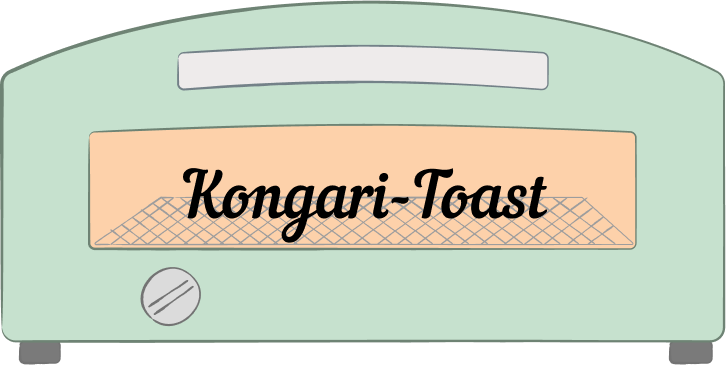

<p align="center">

</p>


[](https://www.npmjs.com/package/kongari-toast)

# Kongari-Toast 🍞

**Kongari-Toast** - Lightly crisp, no extra toppings. Just clean toast notifications. Auto-fade with progress, and type-based icons and color themes.
Built for Vanilla JS — and yes, it works perfectly with npm too.

## Demo

--- TBD ---

## Installation

### npm

```bash
npm install kongari-toast
```

```js
// main.js (using bundler)
import { Toast } from "kongari-toast";

new Toast("save!", "success");
```

### via CDN

```html
<!-- style -->
<link rel="stylesheet" href="https://cdn.jsdelivr.net/npm/kongari-toast/dist/toast.css" />

<!-- ESM Module -->
<script type="module">
    import { Toast } from "https://cdn.jsdelivr.net/npm/kongari-toast/dist/toast.js";

    new Toast("Saved successfully!", "success");
</script>
```

## Basic Usage

After installing Kongari-Toast via CDN or npm, you can use it like this:

### Syntax

```js
new Toast(message, type, options?)
```

| Parameter | Type     | Description                                                    |
| --------- | -------- | -------------------------------------------------------------- |
| `message` | `string` | The text content shown in the toast                            |
| `type`    | `string` | Toast type: `"success"`, `"error"`, `"info"`, `"warning"`      |
| `options` | `object` | (_Optional_) Additional settings (e.g. `duration`, `position`) |

### Example

```js
new Toast("Data saved!", "success");
new Toast("Oops, something went wrong.", "error");
new Toast("Just so you know...", "info", { duration: 5000 });
```

### Options

| Option     | Type     | Default          | Description                                                                            |
| ---------- | -------- | ---------------- | -------------------------------------------------------------------------------------- |
| `duration` | `number` | `3000`ms         | How long (ms) the toast stays visible                                                  |
| `position` | `string` | `"bottom-right"` | Position on the screen: `"top-right"`, `"top-left"`, `"bottom-right"`, `"bottom-left"` |

> The `options` object is likely to expand in future updates.  
> Got a feature you'd like to see?　[Open an issue](https://github.com/4okimi7uki/kongari-toast/issues) — suggestions are always welcome!

---

### Full Example

```js
new Toast("Hello, Kongari-Toast!", "info", {
    duration: 4000,
    position: "bottom-left",
});
```

## Promise Usage

Display toasts that reflect the state of a promise — `loading`, `success`, or `error`.

```js
Toast.promise(
    fetch("/api/save-data"), // your async task
    {
        loading: "Saving...",
        success: "Saved successfully!",
        error: "Failed to save.",
    }
);
```

### Syntax

```js
Toast.promise(promise, messages, options?)
```

| Parameter  | Type      | Description                                                    |
| ---------- | --------- | -------------------------------------------------------------- |
| `promise`  | `Promise` | The asynchronous task to track                                 |
| `messages` | `object`  | Texts for `"loading"`, `"success"`, and `"error"`              |
| `options`  | `object`  | (_Optional_) Additional settings (e.g. `duration`, `position`) |

### Example

```js
Toast.promise(
    new Promise((resolve) => setTimeout(resolve, 2000)),
    {
        loading: "loading...",
        success: "success!!!",
        error: "error!",
    },
    { position: "top-right" }
);
```

> A spinner icon is shown while loading — no setup required！

> No need to use `new Toast()` — `Toast.promise` works directly.

## Customization

If you're using Kongari-Toast via npm, you can freely adjust icons, colors, animations, and layout to match your design needs.

### Modify Icons and Colors

Edit `toastIconMap.js` to customize the icons and associated colors for each toast type.

You can use emojis, SVGs, or even image paths — it's totally up to you.

---

> 2025 Aoki Mizuki – Developed with 🍭 and a sense of fun.
